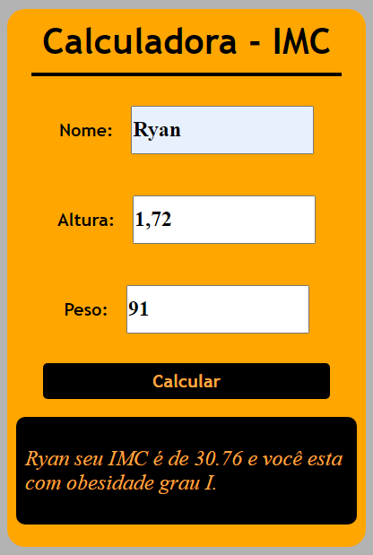

# Mini Projetos com javascript puro

## Objetivo
Não tem outra maneira para se aprender além de **praticar, praticar e praticar**.

Pensando nisso, criei este repositório com objetivo juntar ideias para mini projetos que podem ajudar quem está iniciando no desenvolvimento web utilizando o javascript puro.
Você pode realizar observando o resultado, ou verificando o código, ou ainda acompanhando o desenvolvimento por meio de videos.

Se gostou da ideia acompanhe os projetos abaixo:

<table border ="2">
  <tr>
    <td>
        <h3>00 - Calculadora IMC</h3>
        <li><a href="[./00-imc/](https://github.com/DevFl4me/MiniProjetosJs/tree/main/calculadorIMC)">Código</a></li>
        <li><a href="https://youtu.be/RacwEvoTz_Y">Passo a passo</a></li>
        
    </td>  
</table>
