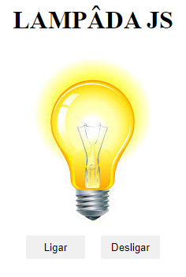

# Mini Projetos com javascript puro

## Objetivo
Não tem outra maneira para se aprender além de **praticar, praticar e praticar**.

Estou com o objetivo de treinar todos os dias, primeiro tentando fazer sozinho e buscando sempre sanar minhas dúvidas.

Se gostou da ideia acompanhe os projetos abaixo:

<table border ="2">
  <tr>
    <td>
        <h3>00 - Calculadora IMC</h3>
        <li><a href="[./00-imc/](https://github.com/DevFl4me/MiniProjetosJs/tree/main/calculadorIMC)">Código</a></li>
        <li><a href="https://youtu.be/RacwEvoTz_Y">Passo a passo</a></li>
        
    </td>  
    <td>
        <h3>01 - Lampâda</h3>
        <li><a href="[./00-imc/](https://github.com/DevFl4me/MiniProjetosJs/tree/main/calculadorIMC)">Código</a></li>
        <li><a href="https://www.youtube.com/watch?v=4r0zOW9Zn-Y&list=PLDgemkIT111AzoS1rB61sgMJbsEA4pyD2&index=3&ab_channel=FernandoLeonid">Passo a passo</a></li>
        
    </td>  
</table>
